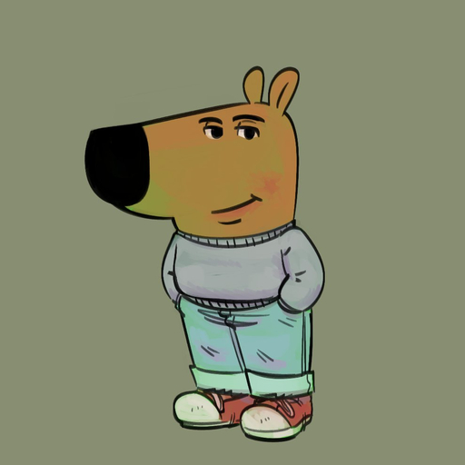

# League of Legends Position Analysis

## Introduction
When I'm cooked for the final exam but I'm just a chill guy who'll just work as Alex's receptionist anyways

## Data Cleaning and Exploratory Data Analysis

### Data Cleaning

### Univariate Analysis
Univariate analysis on

### Bivariate Analysis

### Interesting Aggregates

## Assessment of Missingness

### NMAR Analysis

### Missingness Dependency

## Hypothesis Testing

## Framing a Prediction Problem

## Baseline Model

## Final Model

## Fairness Analysis